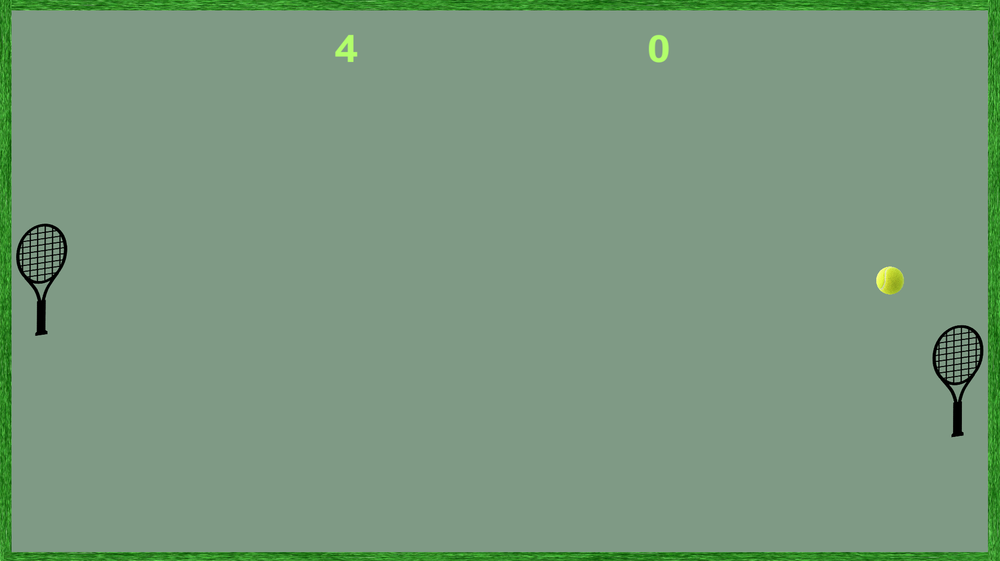

# 🏓 Pong2 (Unity, C#)

Small, fun game similar to classic Pong. Built in 2019 as part of a Bachelor's degree project, coded in Unity (C#).

  
  

## What it does

- Local multiplayer on one keyboard.
- A mode to play against the PC.
- Fun physics: the ball speeds up after paddle hits and the hit angle depends on where it touches the paddle.

You can tweak AI responsiveness, win score, and ball speed in the scripts.

## 🛠️ Build / Executable

- Build: File → Build Settings → PC, Mac & Linux Standalone → Windows x86_64 → add `MainMenu`, `1V1`, `PlayerVSPC` (in this order) → Build.
- Download: Grab the latest Windows build from the Releases page (`Pong2_v1.0.0_Windows_x64.zip`).
- Run: Unzip and start `Pong2.exe`.
